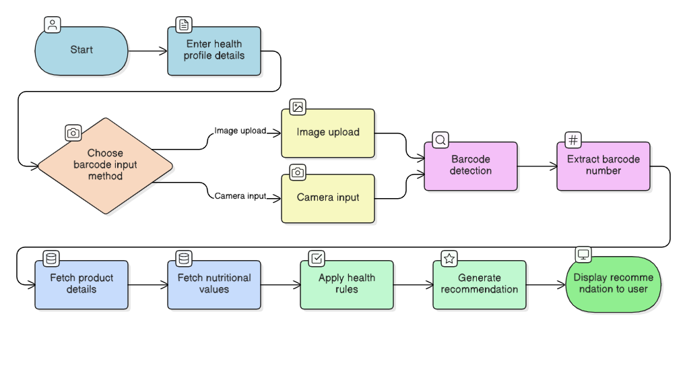

# FoodScan – Intelligent Food Health Analyzer

FoodScan is an AI-powered food scanning application that combines real-time barcode detection, nutritional lookup, and a strict health recommendation engine based on user health profile and WHO dietary guidelines.

It bridges computer vision, nutrition databases, rule-based medical logic, and LLM-assisted recommendations to deliver accurate food health assessments.

## System Workflow

## Features

- Barcode scanning via image upload or live camera

- Personalized health recommendations based on user profile

- Real-time food data fetched from OpenFoodFacts API

- Health rules aligned with WHO dietary guidelines

- AI-assisted decision explanation using Groq LLaMA model

- Deterministic, rule-based logic with strict ingredient validation (missing ingredients → Not Recommended)
- Age-aware recommendations

- Clear decision output with primary health reason

- Lightweight, single-file Streamlit application
  
- Strict safety rule: If ingredients are missing, the product is automatically marked as Not Recommended

## Tech Stack

|Component          |Technology|
|-------------------|----------|
|Frontend UI	      |Streamlit|
|Backend Logic	    |Python|
|Barcode Detection	|OpenCV|
|Image Processing	  |Pillow, NumPy|
|Food Data API	    |OpenFoodFacts|
|AI Model	          |Groq (LLaMA 3.3 via Groq API)|
|Rule Engine	      |WHO + Medical Logic|
|Deployment Ready	  |Streamlit Cloud / Local|

## How It Works

1. **Start the Application**  
   The user launches the FoodScan application using the Streamlit interface.

2. **Enter Health Profile Details**  
   The user provides basic health information such as:

   - Age
   - Diabetes status
   - Blood pressure condition
   - Heart disease condition

3. **Choose Barcode Input Method**  
   The user selects one of the following methods to scan a barcode:

   - Image Upload (upload a barcode image)
   - Camera Input (scan barcode using live camera)

4. **Capture Barcode Image**  
  
   - If Image Upload is selected, the uploaded image is processed.
   - If Camera Input is selected, a live image is captured.

5. **Barcode Detection**  
   The application uses computer vision techniques OpenCV to detect the barcode from the image.

6. **Extract Barcode Number**  
   Once detected, the numeric barcode value is extracted from the image.

7. **Fetch Product Details**  
   The extracted barcode number is used to query the OpenFoodFacts API to retrieve:

   - Product name
   - Ingredients
   - Nutrition data

8. **Fetch Nutritional Values**  
   Key nutritional values per 100g are extracted, such as:
    
   - Sugar
   - Salt
   - Saturated fat
     using a strict, priority-based rule engine.

9. **Apply Health Rules**  
   The system evaluates the nutritional values against:

   - User health conditions
   - Age-based constraints
   - WHO dietary guidelines  
     using a strict, priority-based rule engine.

10. **Generate Health Recommendation**  
    Based on the first matching rule:

    - Recommended
    - Consume with Caution
    - Not Recommended  
      AI (Groq LLaMA model) is used only to format a clear, controlled explanation, while the final decision is governed by the deterministic rule engine.

11. **Display Recommendation to User**  
    The final decision and primary health reason are displayed clearly on the UI.

## Installation

`git clone https://github.com/RiteshRana07/LLM_Based_Health_Aware_Product_Recommendation_System.git` 
`cd your-project` 
`pip install -r requirements.txt`

## Run the Project

**Step 1: Configure Gemini API Key**  
`export GROQ_API_KEY="YOUR_GROQ_API_KEY"`

**Step 2: Start the Application**  
`streamlit run app.py`

**Step 3: Access the Application**  
`http://localhost:8501`

## Feature Enhancements

- Traffic-light nutrition indicators (Green / Yellow / Red) for quick understanding
- Allergen detection and warnings
- Multi-language support for global accessibility
- Smart alerts for unhealthy frequent consumption
